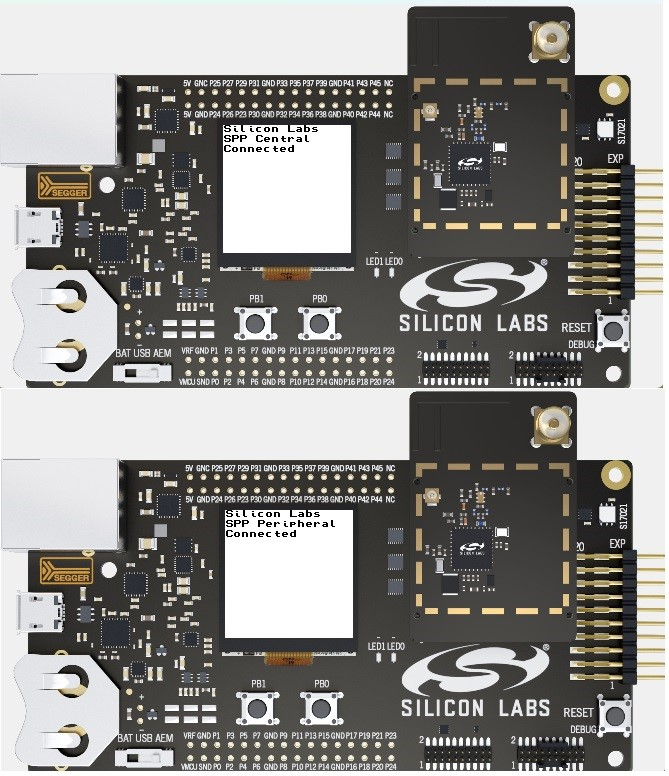

# SoC - SPP

This example application implements a serial port communication between two EFR devices using a custom Bluetooth Low Energy (BLE) service.

> Note: this example does not include Device Firmware Update (DFU) functionality by default. For details see the Device Firmware Update section.

## Getting started

To get started with Silicon Labs Bluetooth and Simplicity Studio, see [QSG169: Bluetooth SDK v3.x Quick Start Guide](https://www.silabs.com/documents/public/quick-start-guides/qsg169-bluetooth-sdk-v3x-quick-start-guide.pdf).

The service defines two custom characteristics that provide a bidirectional communication between the Central and Peripheral.

The Peripheral_RX (receive) and Peripheral_TX (transmit) characteristics are named from the perspective of the Peripheral device. Writing data to the Peripheral_RX characteristic delivers it directly to the Peripheral's serial interface. To receive data, the Central enables notifications on the Peripheral_TX characteristic and then processes the events as they arrive.

Together, these two characteristics form the core of the streaming protocol, providing the low-level data path on which flow control (see the [Flow Control](#flow-control) section for details) and reliable data exchange are built.

The example requires two Silicon Labs kits, such as [SLWSTK6021A](https://www.silabs.com/development-tools/wireless/efr32xg22-wireless-starter-kit), [SLTB010A](https://www.silabs.com/development-tools/thunderboard/thunderboard-bg22-kit) or [BGM220-EK4314A](https://www.silabs.com/development-tools/wireless/bluetooth/bgm220-explorer-kit).

### Usage

The **Bluetooth - SoC SPP** example requires two development kits. When powered on, the firmware starts in **Central mode** by default. To start in **Peripheral mode**, keep **BTN0** pressed while resetting the device. The active role is shown on the second line of the LCD (if applicable) display and also in the console output. A device running in Central mode automatically begins scanning for peripherals that advertise the SPP service UUID.

To exchange data, open a serial terminal on either device and type text. The app reads data from the serial port in the main loop, buffers it inside SPP, and sends it over BLE in **chunks**. Central and Peripheral are symmetric: either side can send and receive, and incoming data is printed on the console.

### Flow Control

The example uses an explicit flow control procedure to manage data transfer and prevent buffer overflows on either side of the connection. Communication begins as soon as a Central connects and enables notifications on the Peripheral_RX characteristic. At this point, both devices exchange information about their available buffer sizes.

The Peripheral initiates the process by sending an **Initial Buffer Size** control message as a notification. This message announces the total number of bytes the Peripheral can store internally. The Central records this value as the **Transmit Bytes Available (TBA)** counter. The Central then responds with its own **Initial Buffer Size** message, which tells the Peripheral how much data it can buffer.

Once the initial exchange is complete, the Central may begin transmitting data to the Peripheral. It can send up to the number of bytes indicated by the **TBA**, using Write Without Response operations on the Peripheral_TX characteristic. Each time data is sent, the **TBA** is decreased by the number of bytes written.

As the Peripheral processes incoming data and frees space in its buffer, it sends **Buffer Bytes Freed** control messages to the Central. Each of these messages increases the Central's **TBA** counter by the number of bytes released, allowing further data to be transmitted. The same mechanism applies in the opposite direction as well: when the Central processes data coming from the Peripheral, it should send **Buffer Bytes Freed** messages back to indicate how much space has been reclaimed. The exact timing of these updates is left to the application design, giving flexibility for different throughput and latency requirements.

This procedure ensures that both devices remain synchronized with each other's buffer capacities, enabling continuous and reliable data streaming without the risk of overflow.

## Device Firmware Update

This example project does not include Device Firmware Update (DFU) functionality by default, but it can be added easily.
SoC applications can use one of Silicon Labs' Over-the-Air (OTA) DFU implementations. The table below summarizes the options:

|                           | In-place OTA DFU                 | Application OTA DFU                 |
|---------------------------|----------------------------------|-------------------------------------|
| **Component to add**      | In-place OTA DFU                 | Application OTA DFU                 |
| **Compatible bootloader** | Bluetooth Apploader OTA DFU      | Bootloader - SoC Internal Storage (Series 2)   Bootloader - SoC Storage (Series 3) |
| **Reference solution**    | Bluetooth - SoC In-Place OTA DFU | Bluetooth - SoC Application OTA DFU |
| **Supported devices**     | Supports Series 2 devices only and requires a smaller flash size | Supports Series 2 and Series 3 devices with enough flash to store firmware images in 2 instances |

To add DFU to an existing project:
- Add the appropriate DFU component to your project using Simplicity Studio’s Software Component browser.
- Add a post-build step to generate the GBL (Gecko Bootloader) file using Simplicity Studio’s Post Build Editor.
- Rebuild the project.
- Flash a compatible bootloader to the device.

For more information on bootloaders, see [UG103.6: Bootloader Fundamentals](https://www.silabs.com/documents/public/user-guides/ug103-06-fundamentals-bootloading.pdf) and [UG489: Silicon Labs Gecko Bootloader User's Guide for GSDK 4.0 and Higher](https://www.silabs.com/documents/public/user-guides/ug489-gecko-bootloader-user-guide-gsdk-4.pdf).

### Programming the Radio Board

Before programming the radio board mounted on the mainboard, make sure the power supply switch is in the AEM position (right side) as shown below.

## Resources

[Bluetooth Documentation](https://docs.silabs.com/bluetooth/latest/)

[UG103.14: Bluetooth LE Fundamentals](https://www.silabs.com/documents/public/user-guides/ug103-14-fundamentals-ble.pdf)

[QSG169: Bluetooth SDK v3.x Quick Start Guide](https://www.silabs.com/documents/public/quick-start-guides/qsg169-bluetooth-sdk-v3x-quick-start-guide.pdf)

[UG434: Silicon Labs Bluetooth ® C Application Developer's Guide for SDK v3.x](https://www.silabs.com/documents/public/user-guides/ug434-bluetooth-c-soc-dev-guide-sdk-v3x.pdf)

[Bluetooth Training](https://www.silabs.com/support/training/bluetooth)

## Report Bugs & Get Support

You are always encouraged and welcome to report any issues you found to us via [Silicon Labs Community](https://www.silabs.com/community).
