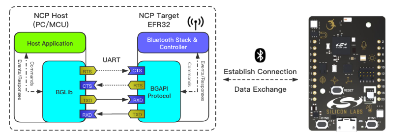
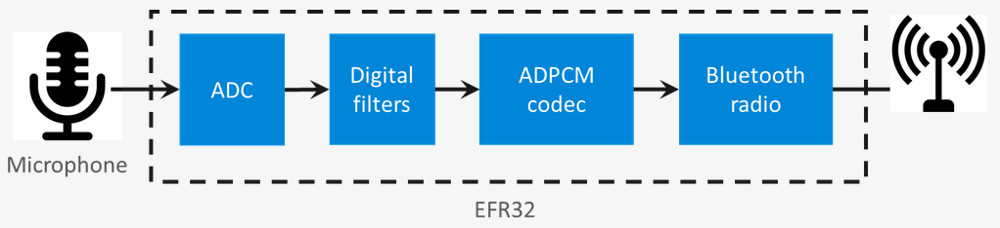

# SoC - Voice

This is a Voice over Bluetooth Low Energy example. It demonstrates how to send voice data over GATT. The example can be used with any board that supports bluetooth and has an on-board microphone (listed below).

Boards which have an on-board microphone and capable of transmitting voice data:
  * xG24 Dev Kit
  * xG26 Dev Kit
  * xG27 Dev Kit
  * Thunderboard EFR32BG22

> Note: this example expects a specific Gecko Bootloader to be present on your device. For details see the Troubleshooting section.

## Getting started

To get started with Silicon Labs Bluetooth and Simplicity Studio, see [QSG169: Bluetooth SDK v3.x Quick Start Guide](https://www.silabs.com/documents/public/quick-start-guides/qsg169-bluetooth-sdk-v3x-quick-start-guide.pdf).

To run the example you need two boards, one for running the SoC Voice example, and another which is able to run an NCP application. [AN1259: Using the v3.x Silicon Labs Bluetooth Stack in Network CoProcessor Mode](https://www.silabs.com/documents/public/application-notes/an1259-bt-ncp-mode-sdk-v3x.pdf) provides a detailed description of how NCP works and how to configure it.

One part of the example, the SoC Voice, runs on the Thunderboard Sense. It provides the Voice-Over-Bluetooth Low Energy GATT service. It uses the microphone of the board to record and transmit voice.

The other part of the project runs on a PC. It connects to a board which is running the **NCP empty** example project. The program on the PC uses the NCP target to scan for the Thunderboard, connect to it, and save the received audio data to the file system of the PC.

## Project Setup

The whole project setup:

### SoC part
Build and flash the provided code example. The device advertises itself after startup with the name "VoBLE Ex". If you have multiple devices, you need to determine the Bluetooth address of the device. This can be done either with the Simplicity Connect app, or through Simplicity Commander.

The EFR32 on the samples the analog microphone using the ADC with the sampling rate and resolution configured by the GATT client. The sampled data is then run through a digital filter (if the filter usage is enabled) and coded using ADPCM codec before being sent via the Bluetooth link to the GATT client using notifications.

## SoC project structure
The example project contains the GATT database with the necessary Voice-over-Bluetooth Low Energy Service. GATT definitions can be extended using the GATT Configurator, which can be found under Advanced Configurators in the Software Components tab of the Project Configurator. To open the Project Configurator open the .slcp file of the project.

To learn how to use the GATT Configurator, see [UG438: GATT Configurator User’s Guide for Bluetooth SDK v3.x](https://www.silabs.com/documents/public/user-guides/ug438-gatt-configurator-users-guide-sdk-v3x.pdf).

The Bluetooth event handling is implemented in the *app.c* file, in the function sl_bt_on_event. This handles the advertising, accepts the configuration parameters, and sends out the data.
The button handling logic is also implemented in this file.
The handling of the microphone, the encoding and filtering can be found in their respective files:
* adpcm.c
* filter.c
* voice.c

## Troubleshooting

### Bootloader Issues

Note that Example Projects do not include a bootloader. However, Bluetooth-based Example Projects expect a bootloader to be present on the device in order to support device firmware upgrade (DFU). To get your application to work, you should either 
- flash the proper bootloader or
- remove the DFU functionality from the project.

**If you do not wish to add a bootloader**, then remove the DFU functionality by uninstalling the *Bootloader Application Interface* software component -- and all of its dependants. This will automatically put your application code to the start address of the flash, which means that a bootloader is no longer needed, but also that you will not be able to upgrade your firmware.

**If you want to add a bootloader**, then either 
- Create a bootloader project, build it and flash it to your device. Note that different projects expect different bootloaders:
  - for NCP and RCP projects create a *BGAPI UART DFU* type bootloader
  - for SoC projects on Series 2 devices create a *Bluetooth Apploader OTA DFU* type bootloader

- or run a precompiled Demo on your device from the Launcher view before flashing your application. Precompiled demos flash both bootloader and application images to the device. Flashing your own application image after the demo will overwrite the demo application but leave the bootloader in place.
  - For NCP and RCP projects, flash the *Bluetooth - NCP* demo.
  - For SoC projects, flash the *Bluetooth - SoC Thermometer* demo.

**Important Notes:**
- when you flash your application image to the device, use the *.hex* or *.s37* output file. Flashing *.bin* files may overwrite (erase) the bootloader.

- On Series 2 devices SoC example projects require a *Bluetooth Apploader OTA DFU* type bootloader by default. This bootloader needs a lot of flash space and does not fit into the regular bootloader area, hence the application start address must be shifted. This shift is automatically done by the *Apploader Support for Applications* software component, which is installed by default. If you want to use any other bootloader type, you should remove this software component in order to shift the application start address back to the end of the regular bootloader area. Note, that in this case you cannot do OTA DFU with Apploader, but you can still implement application-level OTA DFU by installing the *Application OTA DFU* software component instead of *In-place OTA DFU*.

For more information on bootloaders, see [UG103.6: Bootloader Fundamentals](https://www.silabs.com/documents/public/user-guides/ug103-06-fundamentals-bootloading.pdf) and [UG489: Silicon Labs Gecko Bootloader User's Guide for GSDK 4.0 and Higher](https://cn.silabs.com/documents/public/user-guides/ug489-gecko-bootloader-user-guide-gsdk-4.pdf).

### Programming the Radio Board

Before programming the radio board mounted on the mainboard, make sure the power supply switch is in the AEM position (right side) as shown below.

## Resources

[Bluetooth Documentation](https://docs.silabs.com/bluetooth/latest/)

[UG103.14: Bluetooth LE Fundamentals](https://www.silabs.com/documents/public/user-guides/ug103-14-fundamentals-ble.pdf)

[QSG169: Bluetooth SDK v3.x Quick Start Guide](https://www.silabs.com/documents/public/quick-start-guides/qsg169-bluetooth-sdk-v3x-quick-start-guide.pdf)

[UG434: Silicon Labs Bluetooth ® C Application Developer's Guide for SDK v3.x](https://www.silabs.com/documents/public/user-guides/ug434-bluetooth-c-soc-dev-guide-sdk-v3x.pdf)

[Bluetooth Training](https://www.silabs.com/support/training/bluetooth)

## Report Bugs & Get Support

You are always encouraged and welcome to report any issues you found to us via [Silicon Labs Community](https://www.silabs.com/community).